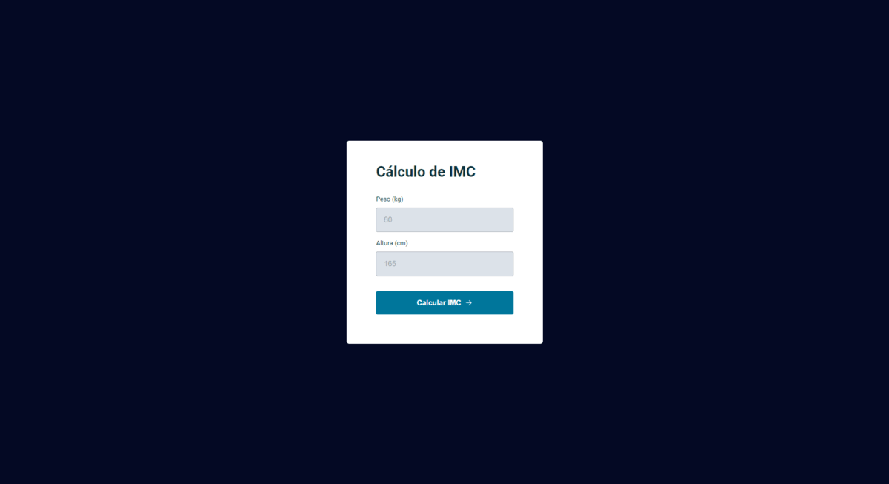

# Rocketseat Explorer - Stage 02 Projeto Solo

Projeto de uma página de cálculo de IMC.

Projeto desenvolvido dento do curso Explorer da Rocketseat c:
Focado no aprendizado de javaScript.

[Clique aqui para acessar](https://buucocs.github.io/expl-stg5-mdl2/)

## Tecnologias

- HTML
- CSS
- javaScript
- Git e Github

## Contato

- contato@leonardohgomes.com.br
- @leonardohgomes_
- https://github.com/Buucocs